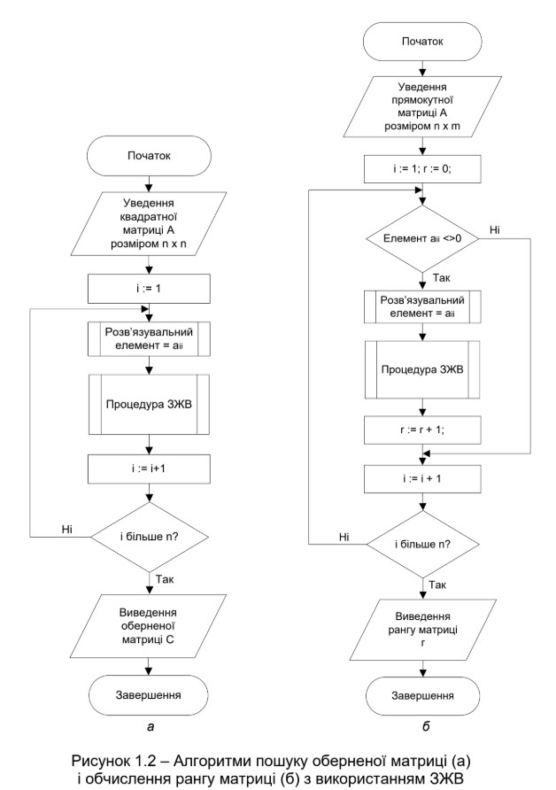
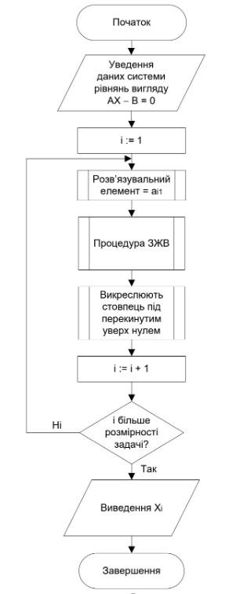

****
# :star2:  **ЗАСТОСУВАННЯ ЗВИЧАЙНИХ ЖОРДАНОВИХ ВИКЛЮЧЕНЬ: ПОШУК ОБЕРНЕНОЇ МАТРИЦІ, ОБЧИСЛЕННЯ РАНГУ МАТРИЦІ,РОЗВ’ЯЗАННЯ СИСТЕМИ ЛІНІЙНИХ АЛГЕБРАЇЧНИХ РІВНЯНЬ**

#### Під час виконання практичної роботи розроблено програму,за допомогою якої на основі звичайних жорданових виключень можна реалізувати такі дії:
1. Пошук оберненої матриці для довільної квадратної матриці.
2. Обчислення рангу довільної прямокутної матриці.
3. Розв’язання системи лінійних алгебраїчних рівнянь з попереднім
приведенням її до вигляду Ax − В = 0 (2-й спосіб).
#### Алгоритм пошуку оберненої матриці та рангу наведено на рисунку нижче:

#### Алгоритм пошуку розв'язків наведено нижче:

#### Мій варіант:

#### Результат виконання програми:

### **Дякую за увагу!**
****