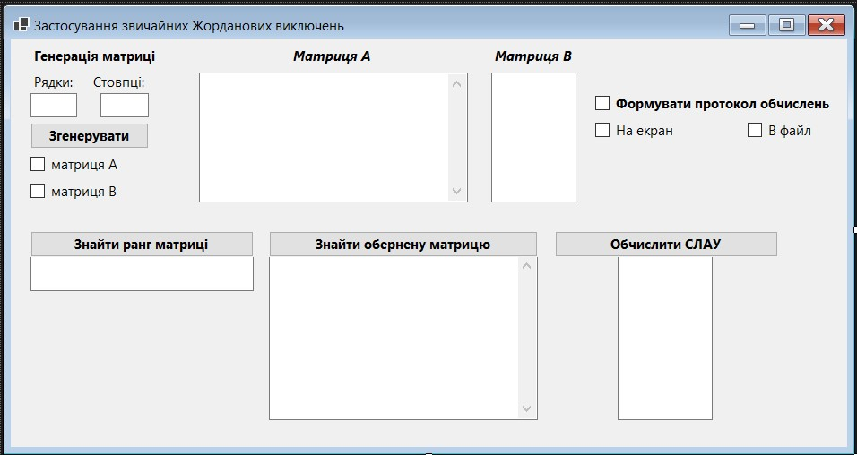
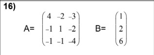
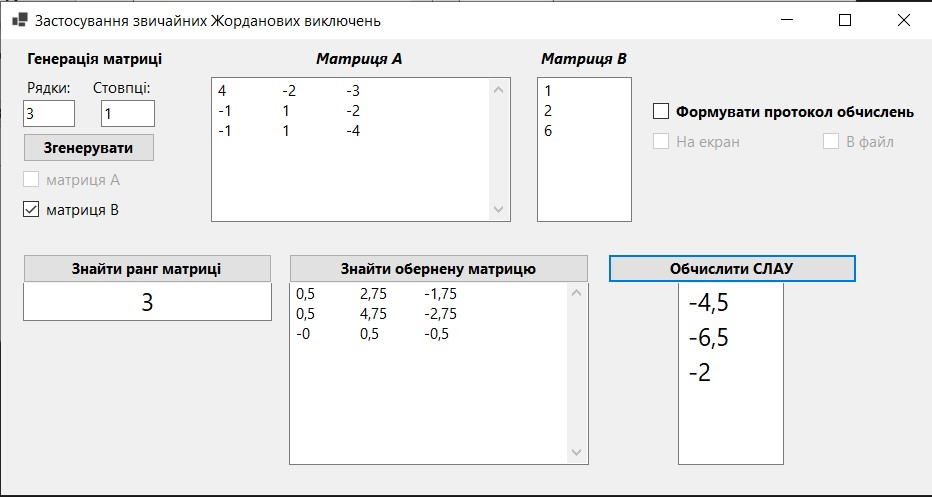
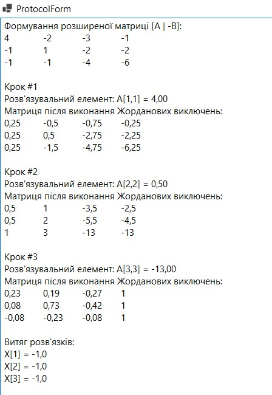
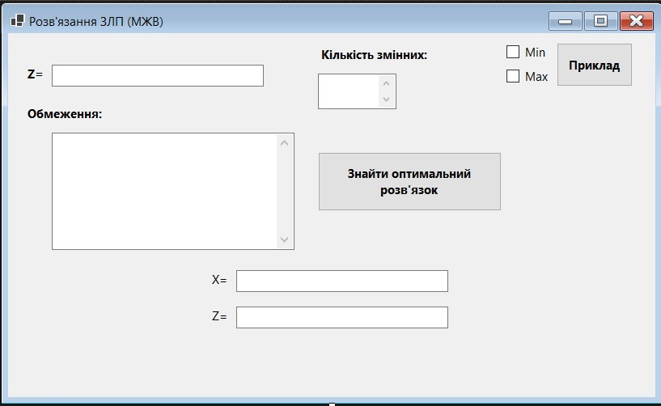
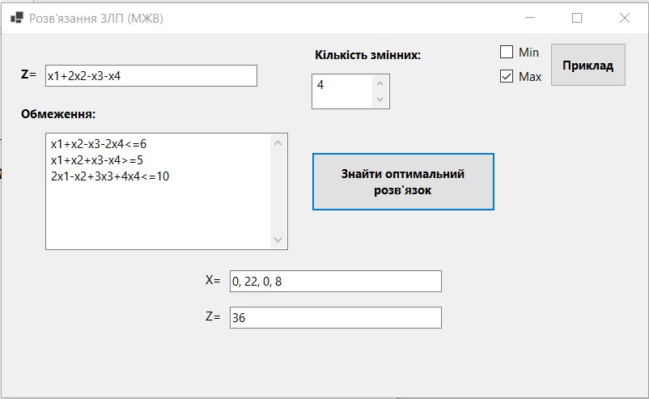
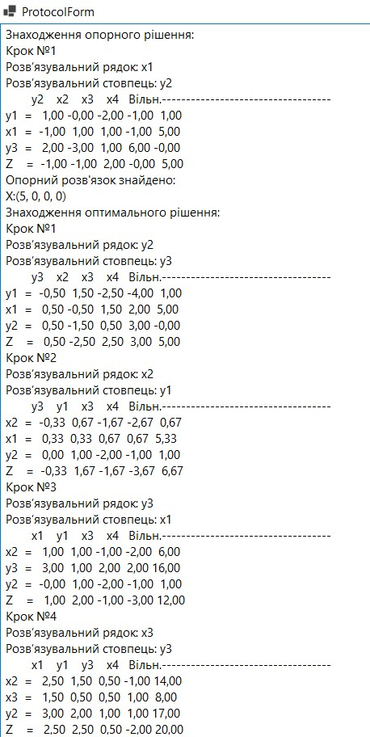
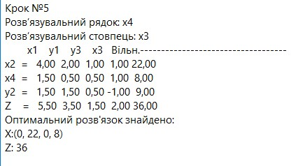
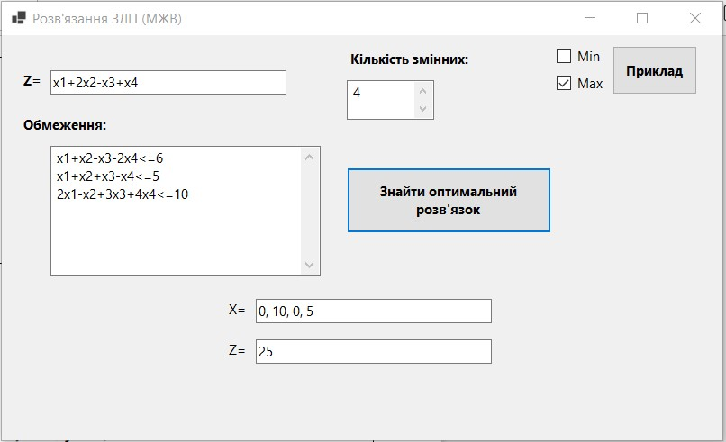
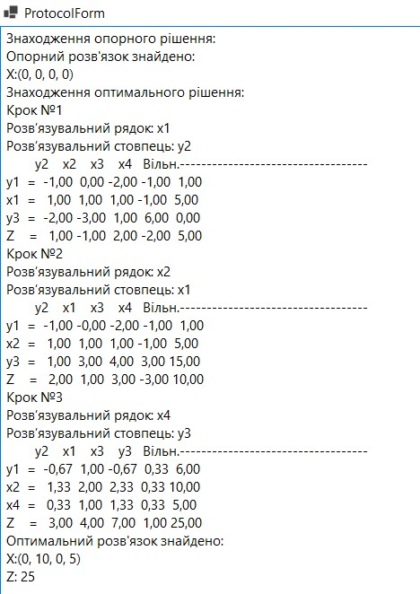

****
# :star2:  Lab1: **ЗАСТОСУВАННЯ ЗВИЧАЙНИХ ЖОРДАНОВИХ ВИКЛЮЧЕНЬ: ПОШУК ОБЕРНЕНОЇ МАТРИЦІ, ОБЧИСЛЕННЯ РАНГУ МАТРИЦІ,РОЗВ’ЯЗАННЯ СИСТЕМИ ЛІНІЙНИХ АЛГЕБРАЇЧНИХ РІВНЯНЬ**

#### Під час виконання практичної роботи розроблено програму,за допомогою якої на основі звичайних жорданових виключень реалізовано такі дії:
1. Пошук оберненої матриці для довільної квадратної матриці.
2. Обчислення рангу довільної прямокутної матриці.
3. Розв’язання системи лінійних алгебраїчних рівнянь з попереднім
приведенням її до вигляду Ax − В = 0 (2-й спосіб).
#### Мій варіант:

#### Результат виконання програми:

# :star2:  Lab2: **РОЗВ’ЯЗАННЯ ЗАДАЧІ ЛІНІЙНОГО ПРОГРАМУВАННЯ ЗА ДОПОМОГОЮ МОДИФІКОВАНИХ ЖОРДАНОВИХ ВИКЛЮЧЕНЬ**

#### Під час виконання практичної роботи розроблено програму,за допомогою якої на основі модифікованих жорданових виключень реалізовано такі дії:
1. Пошук опорного розв’язку задачі лінійного програмування.
2. Пошук оптимального розв’язку задачі лінійного програмування.
#### Приклад:

#### Результат виконання програми:

#### Мій варіант:

#### Результат виконання програми:

### **Дякую за увагу!**
****